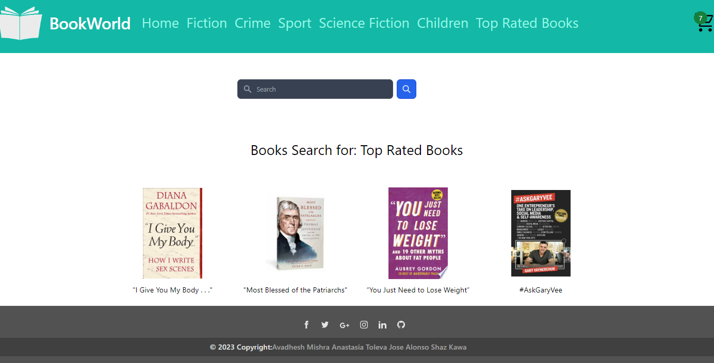

# Bookstore, BookWorld 
Module-16-Project 2

## Description
This ‘bookworld’ website allows the user to search information about books. The application displays the book name, the book cover and its price using the user search input. 

The user can also browse for books by genre using the navbar located at the top of the page. Top rated books are also included in the application in addition to the book genres. 

The user can select the books they wish to purchase by select ‘add to cart’ button. 
The checkout cart is located to  the right top corner of the website. When clicked, it takes the user to a new page where the list of the selected books is shown. The checkout page displays the quantity of books which can be increased and decreased, the individual price plus the shipping and the total price. 

## Prerequisites

The app should:

Must use ReactJS.

Must use Node.

Must have both GET and POST routes for retrieving and adding new data.

Must deploy this application using Netlify.

Must utilize at least two libraries, packages, or technologies that we haven't discussed.

Must have a polished front end/UI.

Must meet good quality coding standards (indentation, scoping, naming).

Have a quality README (with unique name, description, technologies used, screenshot, and link to deployed application).

## Installation
 git repository (https://github.com/D3Turquoise/book-store)

## Deployment
[Project Link] (https://book-store-h3w7rdnhu-d3turquoise.vercel.app/)

(ScreenShot) 

## Usage
N/A

## Credits
Anastasia Toleva
Avadhesh Mishra
Shaz Kawa
Jose Alonso Grana 

## License
Please refer to the LICENSE in the repository.

## Features
N/A

## Tests
N/A

## Resources
- GitHub.
- API’s used:
Google Books
New York Times Best Sellers Books
- React 
- Next.js
- Tailwind CSS
- React Hooks
- HTML
- CSS

